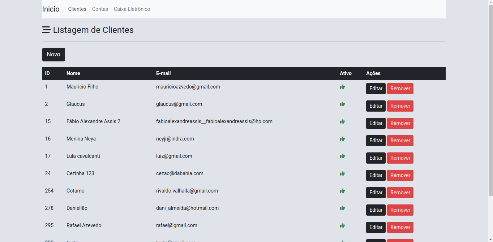
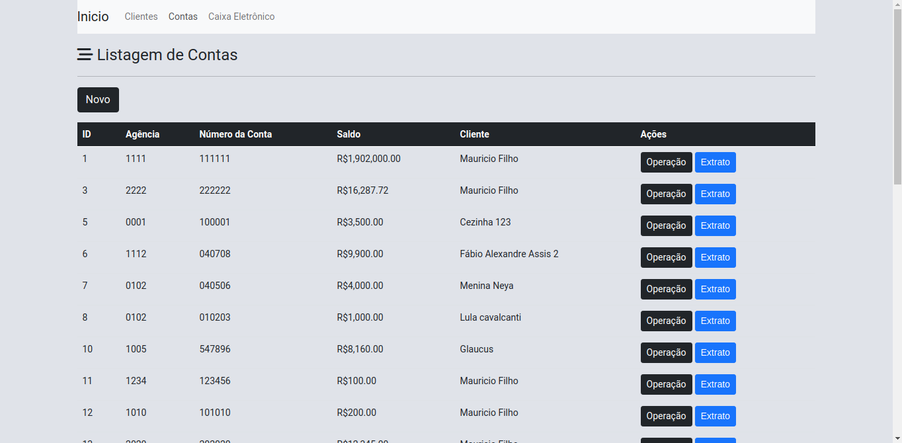
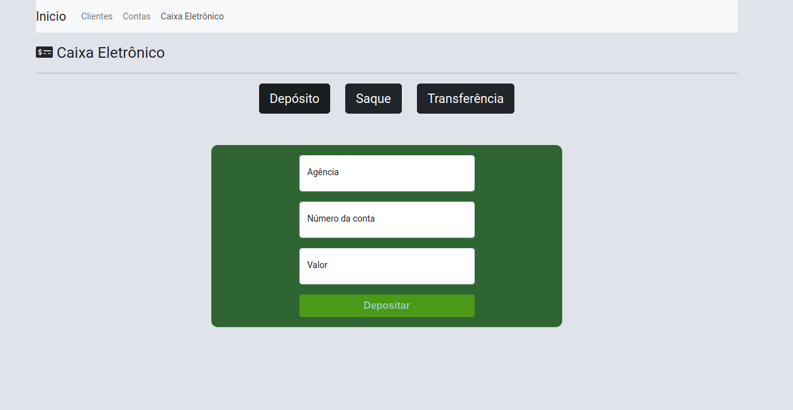
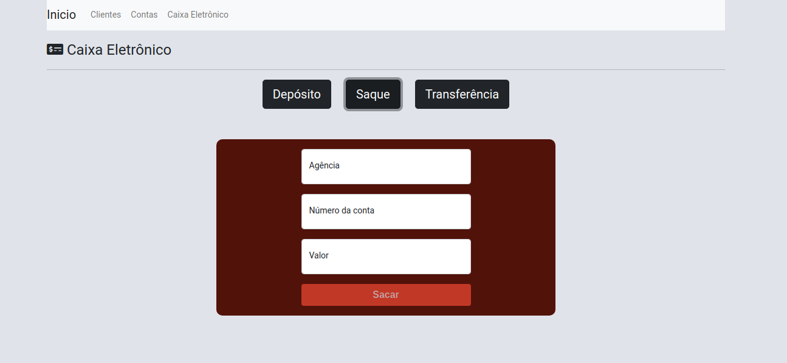
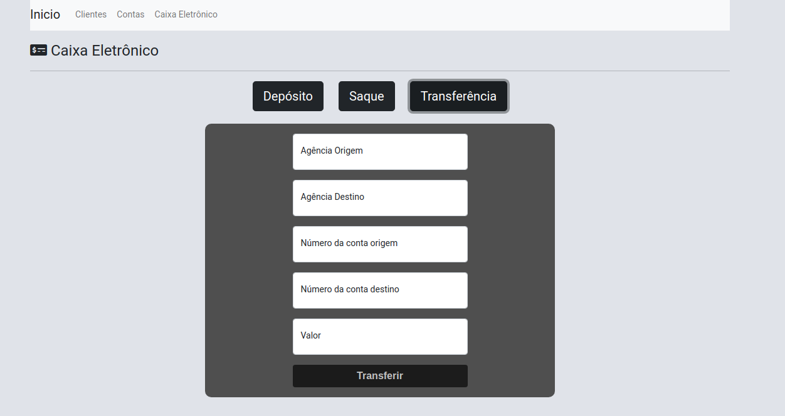

<p align="center">
   <h1>My Bank</h1>
</p>

> :rocket: bank project


<div align="center">
  <sub>
    <a href="https://github.com/Rafaeldsa">Rafael Dantas</a> and
    <a href="https://github.com/Rafaeldsa/Proffy/graphs/contributors">
      contributors
    </a>
  </sub>
</div>

# :pushpin: Table of Contents

* [Technologies](#computer-technologies)
* [Features](#rocket-features)
* [How to Run](#construction_worker-how-to-run)
* [Found a bug? Missing a specific feature?](#bug-issues)


### Web Screenshot
<div>
   
   
   
   
  
</div>

# :computer: Technologies
This project was made using the follow technologies:

* [Typescript](https://www.typescriptlang.org/)      
* [Angular](https://angular.io/)      
* [Spring Boot](https://spring.io/projects/spring-boot)
* [Spring Data](https://spring.io/projects/spring-data)   

# :rocket: Features

* website for customer registration and account management

# :construction_worker: How to run
```bash
# Clone Repository
$ https://github.com/Rafaeldsa/My-Bank.git
```
### 📦 Run API

```bash
# Run Aplication
$ mvn spring-boot:run
```
Access API at http://localhost:8080/treinamento

### 💻 Run Web Project

```bash
# Go to web folder
$ cd view/meubancoangular

# Install Dependencies
$ npm install

# Run Aplication
$ ng serve --open
```
Go to http://localhost:4200/ to see the result.

# :bug: Issues

Feel free to **file a new issue** with a respective title and description on the the [MyBank](https://github.com/Rafaeldsa/Proffy/issues) repository. If you already found a solution to your problem, **i would love to review your pull request**!

